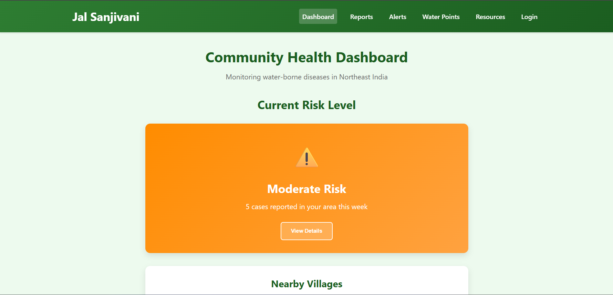
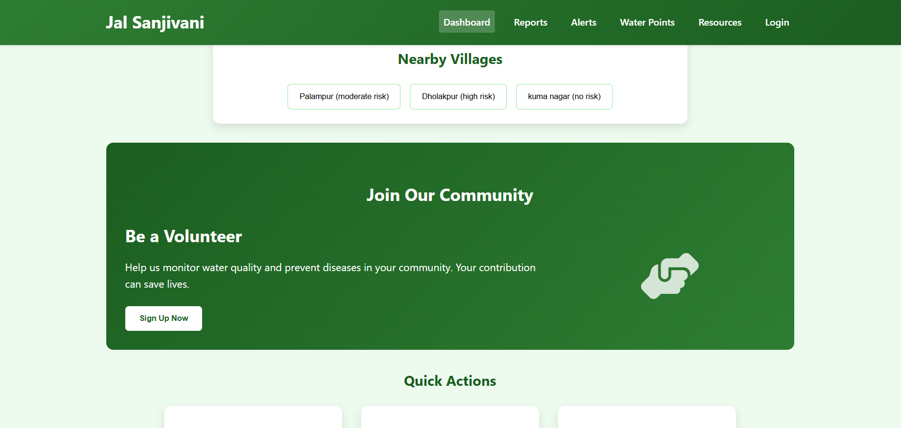
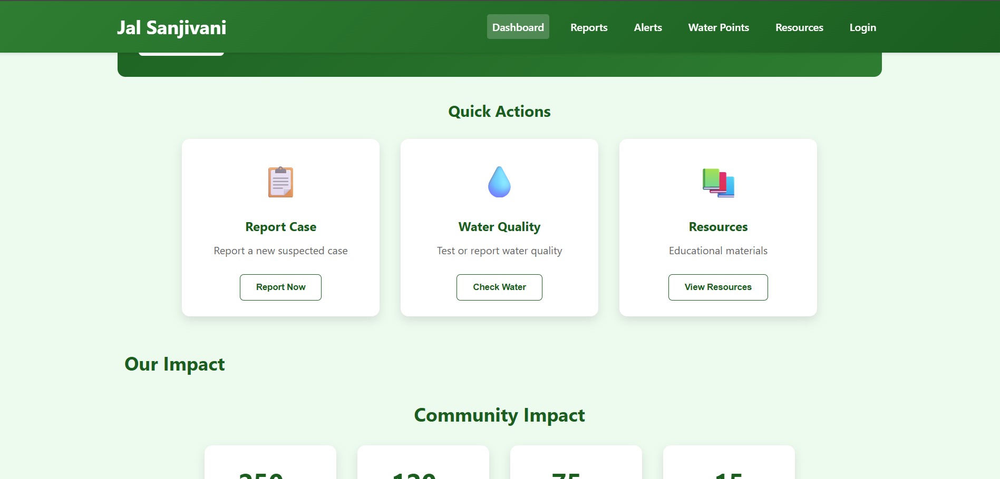
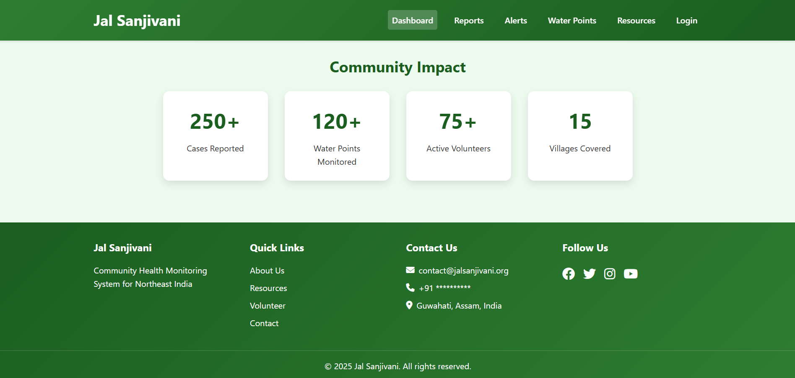

# Data Processor Web App

A lightweight Flask app to upload CSV/JSON files, clean them, show a summary, and download the processed CSV.

## Features

- Upload CSV or JSON/JSONL
- Automatic delimiter detection for CSV; JSON Lines support
- Trims whitespace in string columns, drops fully empty rows, normalizes column names
- Displays dataset summary and per-column stats
- Download cleaned data as CSV

## Requirements

- Python 3.10+

## Setup

```bash
python -m venv .venv
source .venv/bin/activate
pip install -r requirements.txt
```

## Run

```bash
python app.py
```

Then open http://localhost:5000 in your browser.

## Environment

Optional:

- `FLASK_SECRET_KEY` – set a strong secret for session cookies in production

## Notes

This app stores processed files in `./tmp` and serves them for download. Clean up this directory periodically in long-running deployments.

Jal Sanjivani - Community Health Monitoring System
Project Overview
Jal Sanjivani is a comprehensive web-based health monitoring system designed to track and prevent water-borne diseases in rural Northeast India. The platform provides real-time alerts, reporting capabilities, and educational resources for communities.


Features
Dashboard: Overview of current health risks and alerts

Case Reporting: System for reporting suspected disease cases

Water Quality Monitoring: Tools for testing and reporting water quality issues

Resource Library: Educational materials on disease prevention

Alert System: Color-coded risk level notifications

Volunteer Program: Community engagement opportunities

Responsive Design: Works on mobile and desktop devices


<header> with navigation

<main> content area with sections for different features

<footer> with contact information and links

Responsive design elements

CSS Features
Modern, clean design with a health-focused color scheme

Interactive elements with hover effects

Color-coded alert system for risk levels

Flexbox and Grid layout for modern positioning


Future Enhancements
Potential additions to the platform:

Database integration for case tracking

Mobile app version

SMS alert system for areas with limited internet

Multilingual support for local languages

Data visualization tools for health trends

Support
For technical support or questions about implementing this system, please contact the development team.

Designed for rural communities in Northeast India to combat water-borne diseases through technology and community engagement.




Soumya Jain